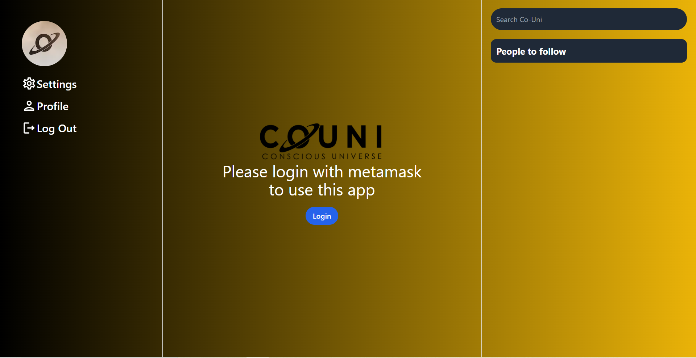
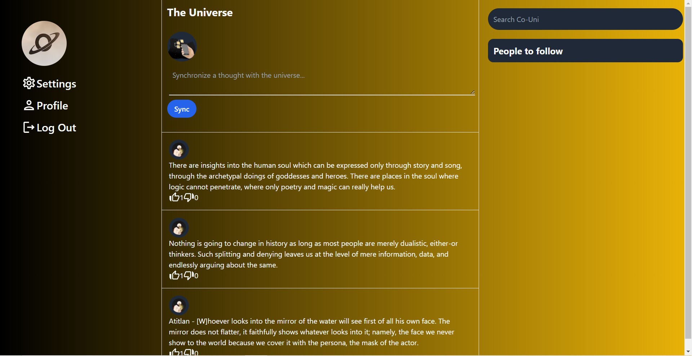

# Web 3.0 Twitter Clone

### About
---
This is a proof of concept for Co-Uni.
A twitter clone built using next.js, moralis.io, Lens Protocol and tailwindcss. 

### Demo
---
Here's a [demo](https://web3-0-twitter-clone.vercel.app/) for the application.

### Features
---
This application contains the following features:
- authentication with metamask
- editing username
- posting a new tweet
- deleting an old tweet
- like and dislike a tweet
- follow other users
- show user recommendations to follow

### Screenshots
---




### Installation
---
1. download the repository
2. create a new server in [moralis.io](https://moralis.io/)
3. in the server, add the following code to the cloud function
```
Moralis.Cloud.define("getUsers", async function (request) {
  const query = new Parse.Query("User");
  const result = await query.find({ useMasterKey: true });
  return result;
});
```
4. create a .env file, and paste in the following code:
```
NEXT_PUBLIC_URL=the url of your moralis server
NEXT_PUBLIC_ID=the id of your moralis server
```
5. run:
```
npm install
npm run dev
```
6. go to http://localhost:3000 and enjoy!
